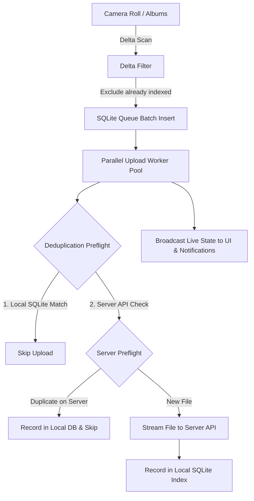
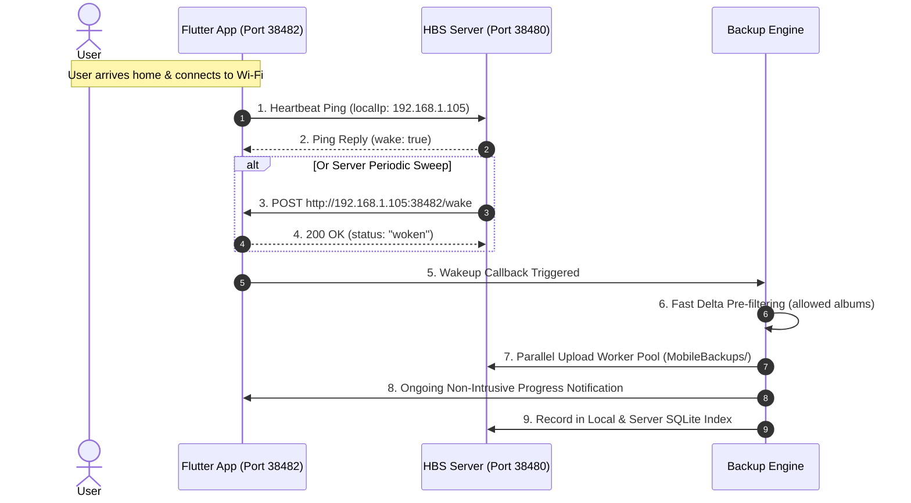

# HBS Global Backup Engine Documentation

Welcome to the **HBS Global Backup Engine** documentation. This document explains the architecture, algorithms, implementation details, data flow, and file organization of the backup and background synchronization system in the HBS Flutter mobile application.

---

## Table of Contents
1. [Overview & Architecture](#overview--architecture)
2. [What and Where (Directory Structure)](#what-and-where-directory-structure)
3. [What Was Done & How It Was Done](#what-was-done--how-it-was-done)
4. [Core Algorithms](#core-algorithms)
   - [4.1 Tiered Deduplication Algorithm](#41-tiered-deduplication-algorithm)
   - [4.2 High-Throughput Delta Indexing & Enqueuing](#42-high-throughput-delta-indexing--enqueuing)
   - [4.3 Parallel Upload Worker Pool](#43-parallel-upload-worker-pool)
   - [4.4 Autonomous Background Task & Device Media Discovery](#44-autonomous-background-task--device-media-discovery)
   - [4.5 Battery Optimization Exemption Strategy](#45-battery-optimization-exemption-strategy)
   - [4.6 Dynamic Throttled Progress Notifications](#46-dynamic-throttled-progress-notifications)
   - [4.7 Server-Initiated LAN Device Wakeup & Zero-Battery Silent Auto-Backup](#47-server-initiated-lan-device-wakeup--zero-battery-silent-auto-backup)
5. [Backwards Compatibility & Migration Strategy](#backwards-compatibility--migration-strategy)
6. [API & Provider Integration Guide](#api--provider-integration-guide)

---

## 1. Overview & Architecture

The HBS Backup Engine is an end-to-end, resilient synchronization pipeline designed for mobile devices. It safeguards user photos and videos by streaming them from local camera rolls to the user's self-hosted HBS server.



Key goals achieved by this engine:
- **Zero redundant work**: Files are never re-hashed or re-uploaded if already indexed.
- **Battery & Doze resilience**: Can request full unrestricted battery access to prevent Android OS process kills during active or scheduled backups.
- **Autonomous background operation**: Discovers new camera roll items even when the application is minimized or closed.
- **User control**: Provides granular preferences for notifications, Wi-Fi constraints, and battery saver modes.

---

## 2. What and Where (Directory Structure)

All backup and background execution codes are unified under `lib/core/backup_engine/`:

```
lib/core/backup_engine/
├── docs.md                             <-- Complete documentation (this file)
├── backup_engine.dart                  <-- Main barrel export
├── models/
│   └── backup_item.dart                <-- IndexedBackupItem and QueueUploadItem models
├── index/
│   └── backup_index_db.dart            <-- SQLite database (backup_index & upload_queue tables)
├── dedupe/
│   └── dedupe_engine.dart              <-- Tiered SHA-256 hash & preflight deduplication
├── queue/
│   └── upload_queue_engine.dart        <-- Parallel worker pool, concurrency & queue execution
├── background/
│   └── background_worker.dart          <-- WorkManager background dispatcher & camera roll delta scanner
├── battery/
│   └── battery_optimizer.dart          <-- Battery optimization exemption & system settings deep-linking
├── notifications/
│   └── backup_notifications.dart       <-- Dynamic progress notification & system permission handling
└── client/
    └── backup_api_client.dart          <-- Dedicated network client wrapping HBS server upload endpoints
```

---

## 3. What Was Done & How It Was Done

### What Was Done
1. **Centralized Engine**: Moved backup-related codes (indexing, deduplication, queueing, background workers, notifications, battery management) into `lib/core/backup_engine/`.
2. **Autonomous Background Task**: Integrated `workmanager` to periodically run in a headless Flutter isolate, scan the camera roll for newly captured photos, and upload them without requiring user interaction.
3. **Battery Optimization Option**: Added `REQUEST_IGNORE_BATTERY_OPTIMIZATIONS` in `AndroidManifest.xml` and built an interactive battery optimization manager in `SettingsScreen` and `BackupScreen`.
4. **Backup Progress Notifications**: Built a notification manager using `flutter_local_notifications` that provides a single dynamic ongoing progress bar in Android's notification drawer, with toggle controls in both Settings and Backup screens.
5. **Fixed Pre-Existing Bugs & Code Breaks**:
   - Fixed document MIME type grouping in `DriveProvider` (`case 'doc'` / `case 'document'`).
   - Fixed large photo library performance bottleneck: Replaced naive insertion of thousands of existing photos with high-speed O(1) in-memory delta pre-filtering before enqueuing.
   - Added backwards-compatible shims in `lib/services/` so no existing imports break.

---

## 4. Core Algorithms

### 4.1 Tiered Deduplication Algorithm
Located in [`dedupe/dedupe_engine.dart`](file:///c:/programming/Turborepo/hbs-home-backup-system/apps/hbs-app-flutter/lib/core/backup_engine/dedupe/dedupe_engine.dart).

1. **Tiered SHA-256 Hashing**:
   - For files $\le$ 4MB (standard compressed JPEGs, icons):
     $$\text{hash} = \text{SHA-256}(\text{all bytes})$$
   - For files $>$ 4MB (4K videos, high-resolution RAW, DNG):
     Reading multiple gigabytes from flash memory to calculate a hash drains battery and causes I/O bottlenecks. The engine reads a deterministic 3MB sample:
     - 1MB from the head (offset 0)
     - 1MB from the middle (offset $\lfloor \text{length} / 2 \rfloor$)
     - 1MB from the tail (offset $\text{length} - 1\text{MB}$)
     Combined with file size:
     $$\text{hash} = \text{SHA-256}(\text{"size:"} + \text{length} + \text{head} + \text{mid} + \text{tail})$$
2. **Two-Tier Deduplication Preflight**:
   - **Step 1 (Local SQLite, < 1ms)**: Queries `backup_index` table by `checksum` or `(file_name, file_size)`. If found, immediately returns `true` without touching the network.
   - **Step 2 (Remote Preflight, ~20ms)**: If not in local SQLite, queries the server endpoint `/api/user/upload/check`. If the server already owns the file, it automatically records it in the local SQLite index to ensure all future checks are instant local hits.

---

### 4.2 High-Throughput Delta Indexing & Enqueuing
Located in [`queue/upload_queue_engine.dart`](file:///c:/programming/Turborepo/hbs-home-backup-system/apps/hbs-app-flutter/lib/core/backup_engine/queue/upload_queue_engine.dart) and [`index/backup_index_db.dart`](file:///c:/programming/Turborepo/hbs-home-backup-system/apps/hbs-app-flutter/lib/core/backup_engine/index/backup_index_db.dart).

When a user has 15,000 photos, inserting all 15,000 items into SQLite sequentially takes 5–10 seconds.
The engine eliminates this bottleneck:
1. Calls `BackupIndexDb().getUploadedKeys()` which reads all indexed filenames and sizes into memory hash sets in a single query.
2. Filters the candidate photos in memory: any file whose `name|size` or name is already indexed is discarded immediately.
3. Uses `db.batch()` inside SQLite to insert only the unbacked delta items (typically 5–20 new photos) in $< 20\text{ms}$.

---

### 4.3 Parallel Upload Worker Pool
Located in [`queue/upload_queue_engine.dart`](file:///c:/programming/Turborepo/hbs-home-backup-system/apps/hbs-app-flutter/lib/core/backup_engine/queue/upload_queue_engine.dart).

1. **Worker Allocation**:
   - In Normal Mode: 4 concurrent asynchronous workers.
   - In Battery Saver Mode: 2 concurrent workers to minimize CPU thermals and battery draw.
2. **Atomic Work Stealing**:
   Workers pop items atomically from the pending queue and process uploads simultaneously.
3. **Cancellation Token**:
   `Dio.CancelToken` is passed to in-flight uploads. Calling `cancelSync()` immediately aborts network sockets and stops all workers gracefully.
4. **State Broadcasting**:
   Emits immutable `SyncState` snapshots to a broadcast stream (`stateStream`) that updates UI progress bars and notification counters simultaneously.

---

### 4.4 Autonomous Background Task & Device Media Discovery
Located in [`background/background_worker.dart`](file:///c:/programming/Turborepo/hbs-home-backup-system/apps/hbs-app-flutter/lib/core/backup_engine/background/background_worker.dart).

1. Registered via `workmanager` to run periodically (every 15m, 30m, 1h, 6h, or daily).
2. Runs in a headless Android/iOS background isolate via `@pragma('vm:entry-point') void hbsBackgroundDispatcher()`.
3. Verifies constraints:
   - Is `autoBackup` enabled by the user?
   - Is Wi-Fi available (if `wifiOnly` is checked)?
   - Is the user logged in with a valid session token?
4. Scans user-selected albums (or all device media if no specific folder is selected).
5. Pre-filters against `BackupIndexDb` and enqueues newly captured photos.
6. Uploads the delta batch using `UploadQueueEngine` with single-worker concurrency in the background.

---

### 4.5 Battery Optimization Exemption Strategy
Located in [`battery/battery_optimizer.dart`](file:///c:/programming/Turborepo/hbs-home-backup-system/apps/hbs-app-flutter/lib/core/backup_engine/battery/battery_optimizer.dart).

- Android puts applications into **Doze Mode** and restricts background execution when the device is idle or the app is minimized.
- By including `android.permission.REQUEST_IGNORE_BATTERY_OPTIMIZATIONS`, HBS can request exemption from battery optimization.
- Once exempted, Android OS will not terminate background sync jobs or throttle network sockets during camera roll backups.
- Both `SettingsScreen` and `BackupScreen` provide visual indicators and interactive actions for the user to grant this exemption with a single tap.

---

### 4.6 Dynamic Throttled Progress Notifications
Located in [`notifications/backup_notifications.dart`](file:///c:/programming/Turborepo/hbs-home-backup-system/apps/hbs-app-flutter/lib/core/backup_engine/notifications/backup_notifications.dart).

- Progress notification channel: `hbs-sync-progress` (`Importance.low`, silent, ongoing, non-intrusive).
- Updates are **throttled to max 1 update every 300ms** to prevent flooding the Android notification manager.
- On completion, posts to `hbs-sync-complete` (`Importance.default`) with sound/vibration alerting the user of the final backup status.
- User can toggle notifications on or off in Settings or Backup screens (`hbs_backup_notifications`).

---

### 4.7 Server-Initiated LAN Device Wakeup & Zero-Battery Silent Auto-Backup
Located in [`wakeup/device_wakeup_server.dart`](file:///c:/programming/Turborepo/hbs-home-backup-system/apps/hbs-app-flutter/lib/core/backup_engine/wakeup/device_wakeup_server.dart) and [`wakeup/network_presence_watcher.dart`](file:///c:/programming/Turborepo/hbs-home-backup-system/apps/hbs-app-flutter/lib/core/backup_engine/wakeup/network_presence_watcher.dart).

1. **The Battery Problem with Continuous Mobile Polling**:
   If the mobile phone constantly polls the server every few seconds or keeps CPU awake checking whether it has returned home to Wi-Fi range, it drains the phone's battery rapidly.
2. **Server-Initiated Detection (Wall-Powered Server Scans)**:
   The HBS Server (running on continuous AC power) maintains a registry of active devices (`MobileDevice` table). The server scans the local network on port `38482` and probes registered device IPs.
3. **Embedded Wakeup Server (Port 38482)**:
   - The Flutter mobile app runs an ultra-lightweight embedded HTTP server on local port `38482` (`dart:io` `HttpServer`).
   - Responds to `GET /ping`: confirms the phone is online and active on LAN.
   - Responds to `POST /wake`: receives `{ action: 'autonomous_sync', serverUrl }`, immediately replies `200 OK`, and triggers the backup pipeline.
4. **Zero-Battery Wi-Fi Reconnect Announcement**:
   - When the user returns home and connects to Wi-Fi, `NetworkPresenceWatcher` listens to native OS connectivity events via `Connectivity().onConnectivityChanged`.
   - Without background loops or polling, the app sends a single ~30ms heartbeat ping (`POST /api/user/device/ping` with its fresh Wi-Fi IP).
   - If the server responds with `wake: true` or calls `POST /wake`, the backup engine wakes up immediately, scans allowed folders for unbacked media, enqueues delta items, and starts the upload worker pool silently in the background.



---

## 5. Backwards Compatibility & Migration Strategy

To guarantee that no other screens or unit tests break:
- `lib/services/backup_index_db.dart` forwards all calls to `lib/core/backup_engine/index/backup_index_db.dart`.
- `lib/services/upload_queue_service.dart` forwards all calls to `lib/core/backup_engine/queue/upload_queue_engine.dart`.
- `lib/services/dedupe_service.dart` forwards all calls to `lib/core/backup_engine/dedupe/dedupe_engine.dart`.
- `lib/core/utils/background_backup.dart` forwards all calls to `lib/core/backup_engine/background/background_worker.dart`.

Existing callers continue to function without any changes, while new components import directly from `package:hbs_app_flutter/core/backup_engine/backup_engine.dart`.

---

## 6. API & Provider Integration Guide

To trigger a backup from Riverpod:
```dart
import 'package:hbs_app_flutter/core/backup_engine/backup_engine.dart';

// Start manual or auto sync
await UploadQueueEngine().startSync(concurrency: 4);

// Check battery optimization status
final isUnrestricted = await BatteryOptimizer().isBatteryOptimizationIgnored();

// Request full battery access
await BatteryOptimizer().requestIgnoreBatteryOptimization();

// Check notification preferences
final notificationsEnabled = BackupNotificationManager().isNotificationsEnabled;
```
