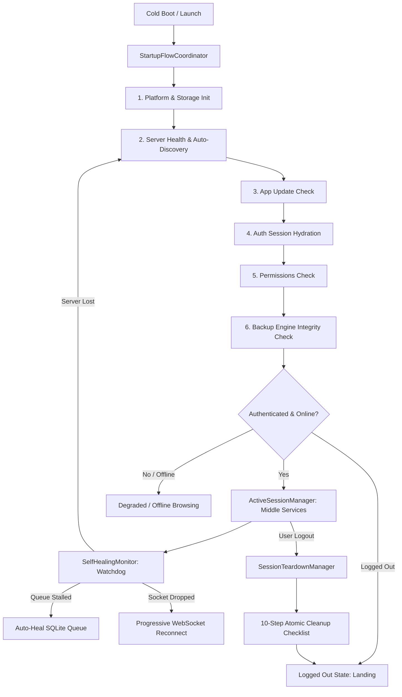

# HBS App Flow & Lifecycle Management Subsystem

Welcome to the **HBS App Flow & Lifecycle Management** architecture documentation. This document provides a complete technical guide on system design, operational stages, self-healing algorithms, guardrail rules, teardown protocols, and file integration across the Flutter application.

---

## Table of Contents
1. [Overview & Architecture](#1-overview--architecture)
2. [Why This Architecture Exists (The Problem Solved)](#2-why-this-architecture-exists-the-problem-solved)
3. [What It Does & What Was Done](#3-what-it-does--what-was-done)
4. [Directory & File Organization](#4-directory--file-organization)
5. [The Lifecycle State Machine](#5-the-lifecycle-state-machine)
6. [Core Algorithms](#6-core-algorithms)
   - [6.1 Deterministic Startup Pipeline](#61-deterministic-startup-pipeline)
   - [6.2 Active Middle-Session Orchestration ("What Runs in the Middle")](#62-active-middle-session-orchestration-what-runs-in-the-middle)
   - [6.3 Continuous Self-Healing & Watchdog Engine](#63-continuous-self-healing--watchdog-engine)
   - [6.4 10-Step Atomic Teardown Protocol ("What NOT to Do After Logout")](#64-10-step-atomic-teardown-protocol-what-not-to-do-after-logout)
   - [6.5 Declarative FlowRules Engine](#65-declarative-flowrules-engine)
7. [Barrel Export & Developer Integration Guide](#7-barrel-export--developer-integration-guide)

---

## 1. Overview & Architecture

The **Flow Subsystem** (`lib/core/flow/`) acts as the single orchestrator and brain for the application's runtime lifecycle. It coordinates system bootstrap, server discovery, software update validation, permissions verification, auth hydration, backup engine health checks, middle-tier background/realtime service maintenance, and atomic logout teardown.



---

## 2. Why This Architecture Exists (The Problem Solved)

In complex client-server applications that handle continuous media backups, realtime WebSockets, and background sync, lifecycle logic frequently suffers from **fragmentation**:
- **Scattered Service Launches**: `WatchFolderService` was called in multiple random places (`main.dart` and `app_shell.dart`); `initBackgroundBackup()` ran unconditionally on boot even if the user had signed out; WebSockets connected without checking if the server was healthy.
- **Race Conditions on Startup**: The app tried to query photos before storage permissions were evaluated; or tried to make API calls before server discovery resolved the active LAN IP.
- **Leaked Services After Logout**: When a user signed out, background upload queues, notification tray progress bars, camera roll change callbacks, and WebSocket heartbeat timers often remained active in memory, attempting unauthenticated uploads in the background.
- **No Unified Self-Healing**: If the user walked out of Wi-Fi range or the server restarted, components failed silently with ad-hoc timeouts rather than coordinating automatic discovery and recovery.

The `flow` subsystem centralizes all these responsibilities into a single, predictable, rule-driven orchestrator.

---

## 3. What It Does & What Was Done

1. **Created `lib/core/flow/`**: A dedicated modular domain for the application's lifecycle, rules, and auto-healing.
2. **Unified Startup Pipeline (`StartupFlowCoordinator`)**: Orchestrates the exact order of startup operations without blocking the UI or crashing on network dropouts.
3. **Formalized "What Needs to Run in the Middle" (`ActiveSessionManager`)**: Coordinates realtime Drive WebSockets, camera roll change listeners, WorkManager tasks, LAN presence announcements, device wakeup listeners, and desktop watch folders.
4. **Enforced "What NOT to Do After Logout" (`LogoutRules` & `SessionTeardownManager`)**: Implemented a strict 10-step atomic cleanup protocol that guarantees zero leaked background tasks or memory structures after sign-out.
5. **Continuous Auto-Recovery (`SelfHealingMonitor`)**: Added background watchdog routines that recover severed LAN connections, reconnect WebSockets, and un-stall pending upload queues automatically.
6. **Unified Barrel Export (`flow.dart`)**: Developers only need to import `package:hbs_app_flutter/core/flow/flow.dart` to access all flow states, rules, and managers.

---

## 4. Directory & File Organization

```
lib/core/flow/
├── flow.dart                               <-- Main barrel export
├── doc.md                                  <-- Complete documentation (this file)
├── models/
│   ├── app_flow_state.dart                 <-- FlowStage, AppFlowState, FlowHealthReport
│   └── flow_event.dart                     <-- FlowEvent hierarchy for reactive listening
├── rules/
│   ├── flow_rules.dart                     <-- Declarative FlowRules evaluation
│   └── logout_rules.dart                   <-- Prohibited actions & 10-step cleanup checklist
├── engine/
│   ├── startup_flow_coordinator.dart       <-- Deterministic boot & initialization pipeline
│   ├── active_session_manager.dart         <-- Middle-stage active session service manager
│   ├── session_teardown_manager.dart       <-- Atomic logout teardown executor
│   ├── self_healing_monitor.dart           <-- Watchdog, connection recovery & queue healer
│   └── app_flow_orchestrator.dart          <-- Master singleton managing states & transitions
└── observers/
    └── app_lifecycle_observer.dart         <-- Flutter WidgetsBindingObserver router
```

---

## 5. The Lifecycle State Machine

The application transitions through discrete, formal stages:

```
[uninitialized]
      │
      ▼
[discoveringServer] ──► (Saved URL ok? ──► No ──► Default URL ok? ──► No ──► Subnet Scan)
      │
      ▼
[checkingUpdates] (Query GitHub releases asynchronously)
      │
      ▼
[hydratingAuth] (Warm local cache ──► Background validation)
      │
      ▼
[checkingPermissions] (Storage / Media & Notifications)
      │
      ▼
[evaluatingBackupEngine] (Check SQLite schema, reset stalled 'uploading' items)
      │
      ├───────────────────────────────┬───────────────────────────────┐
      ▼                               ▼                               ▼
[activeSession]                  [degraded]                      [loggedOut]
(Authenticated & Online)     (Offline / No Perms)             (Awaiting Login)
      │                               │                               │
      ├───────► [recovering] ◄────────┤                               │
      │         (Auto-healing)        │                               │
      ▼                               ▼                               ▼
[loggingOut] ─────────────────────────────────────────────────────────┘
(Teardown)
```

---

## 6. Core Algorithms

### 6.1 Deterministic Startup Pipeline
Located in [`engine/startup_flow_coordinator.dart`](file:///c:/programming/Turborepo/hbs-home-backup-system/apps/hbs-app-flutter/lib/core/flow/engine/startup_flow_coordinator.dart).

1. **Storage & Native Platform Init**:
   - Invokes `enableHighestRefreshRate()` to engage 90Hz/120Hz display modes.
   - Allocates 250MB image cache for silky 120 FPS gallery scrolling.
   - Initializes `StorageService`, `NotificationService`, and `BackupIndexDb`.
2. **Fast 3-Tier Server Connection**:
   - **Tier 1 (Instant Saved Probe)**: Sends `/api/health` to the saved IP/hostname with a short timeout.
   - **Tier 2 (Fallback Default)**: If saved URL fails, tests `http://ajmal.local:38480`.
   - **Tier 3 (Concurrent Subnet Sweep)**: Sweeps the local `/24` subnet using parallel UDP/TCP candidate probing. Returns immediately on the first responding HBS server.
3. **Non-Blocking Update Check**:
   - Queries GitHub releases for semver tags greater than current app version.
4. **Auth Hydration**:
   - Restores session token and user profile; validates against server if online.
5. **Permissions & Backup Engine Evaluation**:
   - Evaluates storage and notification permissions.
   - Checks SQLite queue and auto-heals any deadlocked rows left in `'uploading'` state.

---

### 6.2 Active Middle-Session Orchestration ("What Runs in the Middle")
Located in [`engine/active_session_manager.dart`](file:///c:/programming/Turborepo/hbs-home-backup-system/apps/hbs-app-flutter/lib/core/flow/engine/active_session_manager.dart).

When the application is authenticated and server connectivity is active, the middle stage keeps the following services operational:
1. **Realtime WebSocket Client (`DriveWebSocketService`)**:
   - Subscribes to `/api/ws` with user session token.
   - Dispatches live file mutations, creations, and deletions directly to Riverpod providers.
   - Sends periodic pings every 25s to keep connections alive through NAT gateways.
2. **Camera Roll Live Change Listener (`MediaListenerService`)**:
   - Registers native `PhotoManager.addChangeCallback` to detect camera clicks or downloads in real time.
3. **Headless Background Worker (`BackgroundWorker` / `WorkManager`)**:
   - Registers periodic background tasks with the OS WorkManager for silent syncing when the app is minimized.
4. **LAN Network Presence & Device Wakeup (`NetworkPresenceWatcher` & `DeviceWakeupServer`)**:
   - Listens for remote server wake signals over LAN.
   - Broadcasts presence so the desktop server knows this device is online.
5. **Desktop Watch Folder Service (`WatchFolderService`)**:
   - On Windows/macOS/Linux, observes configured folders for file changes and auto-uploads.
6. **LAN Inbox Polling**:
   - Long-polls `/api/user/inbox` and displays local notification banners for user alerts.

---

### 6.3 Continuous Self-Healing & Watchdog Engine
Located in [`engine/self_healing_monitor.dart`](file:///c:/programming/Turborepo/hbs-home-backup-system/apps/hbs-app-flutter/lib/core/flow/engine/self_healing_monitor.dart).

The system runs a resilient background watchdog:
- **Network Shift Healing**: Listens to `Connectivity().onConnectivityChanged`. When the device reconnects to Wi-Fi or cellular, it probes the server and triggers subnet auto-discovery if the IP shifted.
- **Queue Deadlock Healing**: If an upload worker crashed or the app was force-quit mid-upload, items could be trapped in `status = 'uploading'`. The self-healing monitor automatically queries:
  $$\text{UPDATE upload\_queue SET status = 'pending' WHERE status = 'uploading'}$$
  and signals `UploadQueueEngine().resumePending()`.
- **WebSocket Reconnection with Progressive Backoff**:
  When disconnected, backs off progressively:
  $$\text{delay} \in \{2s, 4s, 8s, 16s, 30s\}$$
  preventing battery drain while guaranteeing swift reconnection.

---

### 6.4 10-Step Atomic Teardown Protocol ("What NOT to Do After Logout")
Located in [`rules/logout_rules.dart`](file:///c:/programming/Turborepo/hbs-home-backup-system/apps/hbs-app-flutter/lib/core/flow/rules/logout_rules.dart) and [`engine/session_teardown_manager.dart`](file:///c:/programming/Turborepo/hbs-home-backup-system/apps/hbs-app-flutter/lib/core/flow/engine/session_teardown_manager.dart).

When a user logs out, the following checklist is executed atomically:

| Step | Action | Method Executed | Guarantee |
|:---|:---|:---|:---|
| 1 | Halt Upload Workers | `UploadQueueEngine().cancelSync()` | Ongoing chunk streams aborted immediately |
| 2 | Dismiss Notifications | `BackupNotificationManager().cancelSyncNotification()` | Progress bar vanishes from drawer |
| 3 | Stop Media Listener | `MediaListenerService().stopListening()` | Photo changes ignored |
| 4 | Cancel OS Background Tasks | `cancelBackgroundBackup()` | WorkManager stops waking app |
| 5 | Clear Pending Queue | `BackupIndexDb().clearQueue()` | No residual uploads queued for next user |
| 6 | Disconnect WebSocket | `DriveWebSocketService().disconnect()` | Socket closed, reconnect timers cancelled |
| 7 | Stop Presence & Wakeup | `NetworkPresenceWatcher().stop()`, `DeviceWakeupServer().stop()` | UDP/TCP ports released |
| 8 | Stop Watch Folder | `WatchFolderService().stop()` | File system watchers closed |
| 9 | Pause Middle Timers | `ActiveSessionManager().pauseMiddleServices()` | Inbox streams and timers cancelled |
| 10 | Wipe Session Storage | `StorageService().clearSession()` | SecureStore and SharedPreferences tokens erased |

---

### 6.5 Declarative FlowRules Engine
Located in [`rules/flow_rules.dart`](file:///c:/programming/Turborepo/hbs-home-backup-system/apps/hbs-app-flutter/lib/core/flow/rules/flow_rules.dart).

Provides pure static boolean methods to inspect permissions, network constraints, and battery states:
- `FlowRules.canRunAutoBackup(...)`
- `FlowRules.canRunManualBackup(...)`
- `FlowRules.canConnectWebSocket(...)`
- `FlowRules.canRunBackgroundTasks(...)`
- `FlowRules.canStartMediaListener(...)`
- `FlowRules.canAnnounceNetworkPresence(...)`

---

## 7. Barrel Export & Developer Integration Guide

Developers access everything from a single import:
```dart
import 'package:hbs_app_flutter/core/flow/flow.dart';
```

### Example: Checking Flow Rules
```dart
if (FlowRules.canRunAutoBackup(
  isAuthenticated: authState.isAuthenticated,
  isServerConnected: serverInfo.isConnected,
  hasMediaPermission: backupState.hasPermission,
  autoBackupEnabled: backupState.autoBackup,
  wifiOnly: backupState.wifiOnly,
  isWifi: isCurrentNetworkWifi,
  batterySaverEnabled: backupState.batterySaverEnabled,
  isBatteryLow: isBatteryUnder20Percent,
  isCharging: isDevicePluggedIn,
  isSyncing: backupState.syncState.isSyncing,
)) {
  await backupNotifier.startSync();
}
```

### Example: Inspecting Health Report
```dart
final report = await AppFlowOrchestrator().getHealthReport();
debugPrint('Current Stage: ${report.currentStage}');
debugPrint('Server Connected: ${report.isServerConnected} (${report.serverUrl})');
debugPrint('Backup Engine Healthy: ${report.isBackupEngineHealthy}');
debugPrint('Pending Queue Items: ${report.pendingUploadQueueCount}');
```

### Example: Responding to User Sign In / Out
```dart
// Upon Login:
await AppFlowOrchestrator().onUserLogin(
  serverUrl: serverUrl,
  sessionToken: token,
  autoBackupEnabled: autoBackup,
  hasMediaPermission: hasPermission,
  onTriggerAutoBackup: ({force}) => backupNotifier.autoBackupIfEnabled(force: force ?? false),
);

// Upon Logout:
await AppFlowOrchestrator().onUserLogout(
  onBackendSignOut: () => AuthService().signOut(serverUrl: serverUrl),
);
```
